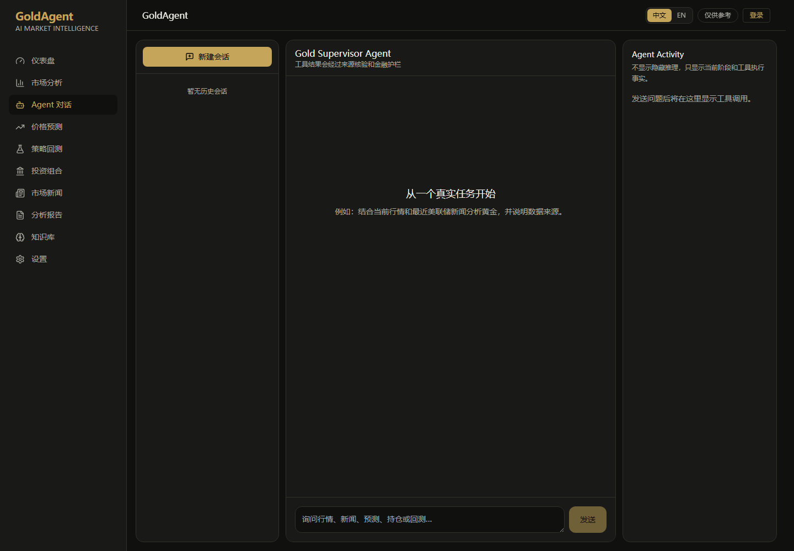
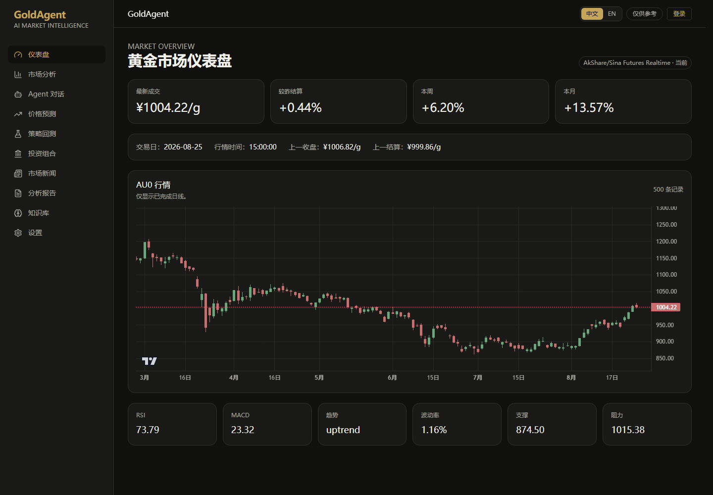
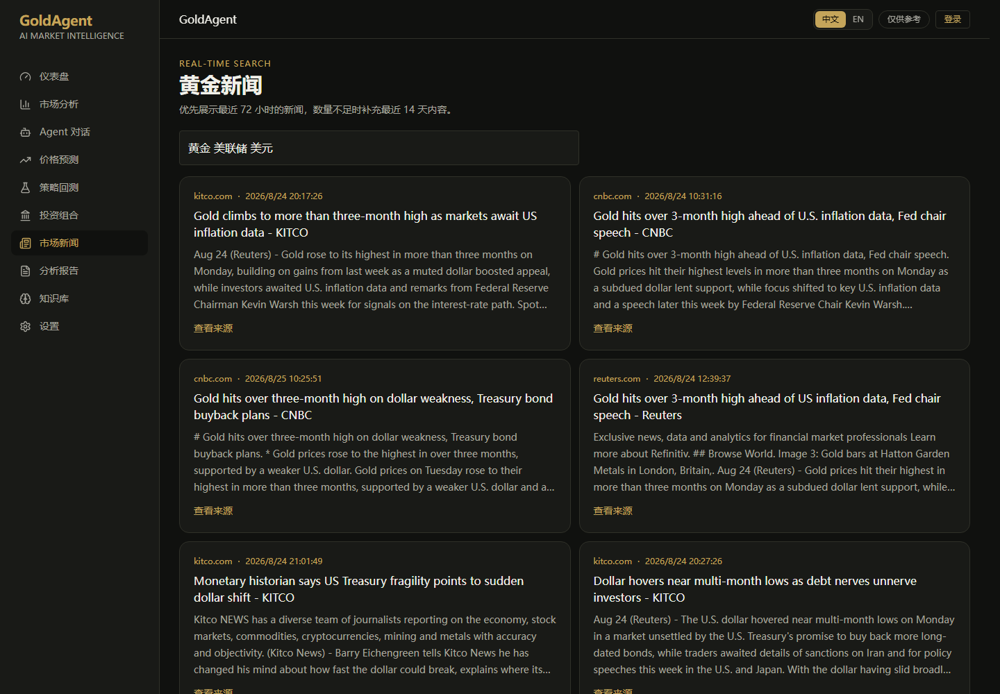
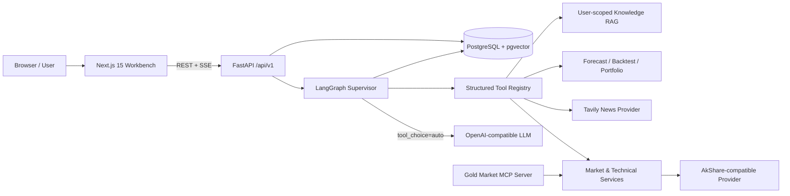

<div align="center">

# GoldAgent

### 面向黄金市场研究的全栈、可观测、可评测 AI Agent

让大模型自主选择行情、技术指标、实时新闻、预测、持仓、回测与个人知识库工具，  
再经过来源核验与金融安全护栏，生成有数据依据的研究结论。

[English](README_EN.md) · [快速开始](#快速开始) · [系统架构](#系统架构) · [技术实现](#技术栈与实现落点) · [测试与评测](#测试与评测)


</div>

> [!IMPORTANT]
> GoldAgent 是研究与决策辅助系统，不连接券商、不执行交易、不承诺收益。外部数据不可用时返回明确错误，不用虚构行情或新闻掩盖失败。

## Agent 对话工作台

模型根据问题动态选择工具；右侧 `Agent Activity` 展示当前阶段和真实工具执行事实，不暴露隐藏推理。

<p align="center">
  
</p>

## 为什么做 GoldAgent

金融 Agent 的难点并不是让模型“谈论市场”，而是让它在实时性、确定性计算、数据来源、用户隔离和风险表达之间建立可靠边界。

GoldAgent 将这些问题拆成一套可落地的工程方案：

- **模型负责决策，工具负责事实**：LLM 根据问题动态选择工具；价格、指标、盈亏、回测等结果由确定性服务计算。
- **数据可追溯**：行情携带来源、直接/推导类型、更新时间和陈旧状态；Agent 回答前统一核验工具结果。
- **实时新闻有明确时间策略**：优先最近 72 小时，结果不足时扩展到 14 天，并保留媒体来源与发布时间。
- **金融风险有显式护栏**：过滤保证收益式表达，缺少持仓上下文时拒绝给出伪精确仓位，并统一追加风险说明。
- **从 Demo 到可部署系统**：包含认证、多用户数据、异步 API、SSE 进度、PostgreSQL/pgvector、CI、Docker Compose、测试与离线评测。

## 项目一览

| 维度 | 已实现内容 |
|---|---|
| Agent | LangGraph 循环编排、自动工具选择、最大步数、超时重试、结果核验、金融护栏、Checkpointer |
| 工具 | **8 个**类型化工具：现价、历史行情、技术指标、新闻、预测、持仓、回测、知识库 |
| 产品 | Dashboard、Market Analysis、Agent Chat、Forecast、Backtest、Portfolio、News、Knowledge、Reports、Settings |
| API | **49 个** FastAPI 路由，覆盖认证、会话、市场、Agent、资产与知识库 |
| 质量 | **55 条**离线评测样例、**27 个**后端/前端测试用例、Playwright E2E、GitHub Actions |
| 交付 | Python 3.12、Node.js 22、PostgreSQL 16 + pgvector、Docker Compose |

## 产品界面

### 黄金市场仪表盘

实时展示 AU0 最新成交、周期涨跌、数据来源、交易时间、K 线和关键技术指标。

<p align="center">
  
</p>

### 实时黄金新闻

优先展示最近 72 小时新闻，数量不足时扩展到 14 天，并保留媒体来源与发布时间。

<p align="center">
  
</p>

## 核心能力

### 1. 动态工具调用 Agent

所有工具通过 Pydantic Schema 和 LangChain `StructuredTool` 暴露给模型，Gateway 使用 `tool_choice=auto`。Supervisor 只执行模型实际选择的工具，并把结果作为观察值返回模型继续规划。

例如问题：

```text
结合当前 AU0 行情、技术指标和最近美联储新闻，分析黄金短期风险，并说明数据来源。
```

可能形成如下执行链：

```mermaid
sequenceDiagram
    participant U as User
    participant A as LangGraph Supervisor
    participant T as Typed Tools
    participant V as Verification & Guardrail

    U->>A: 提交研究问题
    A->>T: get_gold_spot_price
    A->>T: calculate_technical_indicators
    A->>T: search_financial_news
    T-->>A: 结构化结果 + 来源元数据
    A->>V: 候选回答 + 工具轨迹
    V-->>U: 经来源核验与金融护栏的结论
```

前端 `Agent Activity` 通过 SSE 只显示阶段与真实工具执行事实，不暴露隐藏思维链。

### 2. 可信行情与实时新闻

- AkShare 兼容 Provider 提供 AU0 国内黄金行情，并区分直接报价、推导数据、缓存和模拟数据。
- Tavily 新闻采用两级时间窗口：**72 小时优先，少于请求数量时补充 14 天内结果**。
- 新闻按 URL 去重，超过 14 天或缺少发布时间的内容不会进入 Agent 上下文。
- Provider 失败会显式传播错误，不制造“看起来合理”的假数据。

### 3. 确定性金融计算

- 技术分析：MA、RSI、MACD、ATR、波动率、趋势、支撑位与阻力位。
- 预测：线性、指数平滑等基线模型，并提供 Walk-forward 评估指标。
- 回测：信号执行使用 `shift(1)` 防止前视偏差，计入交易成本，并输出基准收益、最大回撤、夏普率、换手率与交易明细。
- 持仓：市值、盈亏、盈亏率、盈亏平衡点和计划加仓后的成本变化均由服务层计算。

### 4. 多用户知识库与持久化

- PDF/文本上传、切块、Embedding、余弦相似度检索。
- 文档和 Chunk 按 `user_id` 隔离，避免跨用户召回。
- PostgreSQL + pgvector 用于生产；SQLite + local hash embedding 只作为本地 Demo。
- 会话、消息、Agent Run、工具轨迹、预测、回测、报告和知识资产统一持久化。

### 5. 可观测、安全与可评测

- JWT Access Token + Refresh Token、PBKDF2 密码哈希、CORS 与端点限流。
- Request ID、结构化 HTTP 日志、`/health` 与 `/ready` 探针。
- 评测覆盖工具选择、参数、执行成功率、来源、幻觉代理、安全、延迟、Token 与成本。
- CI 执行 Python 编译、pytest、TypeScript、Vitest 和 Next.js 生产构建。

## 系统架构



项目遵循 `API → Agent / Service → Provider` 分层：

- Router 负责协议和权限，不承载金融算法。
- Agent 负责工具选择与编排，不直接抓取数据。
- Service 负责确定性业务逻辑，便于单测和复用。
- Provider 隔离第三方数据与模型差异，失败语义保持一致。

## 技术栈与实现落点

| 层 | 技术 | 在项目中的体现 |
|---|---|---|
| Agent Runtime | LangGraph、LangChain Core | `backend/app/agent/graph.py` 状态图、循环工具调用、核验与护栏节点 |
| Tool Calling | StructuredTool、Pydantic | `backend/app/tools/` 中的 8 个类型化工具与输入约束 |
| LLM Adapter | OpenAI-compatible API、httpx | `backend/app/llm/` 统一 MiMo/OpenAI-compatible 请求与 Tool Call 解析 |
| Backend | Python 3.12、FastAPI、Pydantic v2 | 异步 `/api/v1`、依赖注入、SSE、错误模型与 OpenAPI |
| Data & Quant | pandas、NumPy、pandas-ta、AkShare | `services/technical.py`、`forecast.py`、`backtest.py`、行情 Provider |
| Realtime News | Tavily、httpx、Tenacity | 72 小时优先/14 天补足、来源与发布时间、超时重试 |
| Persistence | SQLAlchemy 2 Async、Alembic | Repository 分层、用户/会话/运行/工具轨迹/研究资产模型 |
| Vector Search | PostgreSQL 16、pgvector | 用户隔离的文档 Chunk 与 Embedding 检索 |
| Frontend | Next.js 15、React 19、TypeScript | App Router、双语界面、响应式工作台、SSE Agent Chat |
| Client State | TanStack Query、Zustand | 服务端状态缓存、认证状态和 API 边界 |
| Visualization | ECharts、lightweight-charts | K 线、技术分析、预测与回测可视化 |
| Quality | pytest、Vitest、RTL、Playwright | Unit / Integration / Agent / API / E2E 与离线评测回归 |
| Delivery | Docker、Compose、GitHub Actions | 非 root 镜像、健康检查、三服务编排与 CI |

## 项目结构

```text
GoldAgent/
├── backend/app/
│   ├── agent/          # LangGraph、verification、financial guardrail
│   ├── api/            # FastAPI factory、middleware、routes
│   ├── core/           # dependency container、auth/security
│   ├── db/             # SQLAlchemy models、repositories、async sessions
│   ├── llm/            # provider-neutral LLM gateway
│   ├── providers/      # market、news、embedding adapters
│   ├── rag/            # parsing、chunking、tenant-scoped retrieval
│   ├── services/       # deterministic finance/domain logic
│   └── tools/          # Pydantic schemas + StructuredTool registry
├── frontend/           # Next.js financial research workbench
├── mcp_servers/        # reusable Gold Market MCP server
├── evals/              # datasets、evaluators、regression runners
├── tests/              # unit、integration、agent、API tests
├── docs/               # 当前系统架构与关键运行链路
├── scripts/            # legacy data migration utilities
└── docker-compose.yml  # PostgreSQL + Backend + Frontend
```

## 快速开始

### 方式一：Docker Compose（推荐）

要求：Docker Desktop 已启动。

```powershell
Copy-Item .env.example .env
# 编辑 .env，至少填写一个 OpenAI-compatible LLM Key
docker compose up --build -d
docker compose ps
```

启动后访问：

- Web：`http://localhost:3000`
- API：`http://localhost:8080`
- OpenAPI：`http://localhost:8080/docs`

停止服务：

```powershell
docker compose down
```

> `docker compose down` 不删除 PostgreSQL 数据卷；只有显式添加 `-v` 才会删除本地数据库数据。

### 方式二：本地开发

要求：Python 3.12+、Node.js 22+。

```powershell
# Backend
python -m venv .venv
.\.venv\Scripts\Activate.ps1
pip install -e ".[dev]"
Copy-Item .env.example .env
python run_backend.py

# Frontend（新终端）
Set-Location frontend
npm ci
npm run dev
```

## 配置

`.env.example` 是可公开的配置模板；请复制为不会被 Git 跟踪的 `.env` 后填写真实密钥。

```dotenv
LLM_PROVIDER=mimo
MIMO_MODEL=mimo-v2.5-pro
MIMO_API_KEY=your-key
TAVILY_API_KEY=your-key
DEMO_MODE=true
JWT_SECRET_KEY=replace-in-production
```

| 配置 | 是否必需 | 说明 |
|---|---|---|
| `MIMO_API_KEY` 或兼容模型 Key | 是 | Agent 规划与回答生成 |
| `TAVILY_API_KEY` | 新闻功能需要 | 实时金融新闻搜索 |
| `JWT_SECRET_KEY` | 生产必需 | JWT 签名，部署时必须替换 |
| `DATABASE_URL` | Compose 自动配置 | 本地可用 SQLite，生产使用 PostgreSQL |
| `EMBEDDING_*` | 生产语义检索需要 | Demo 默认使用明确标记的 local hash embedding |

不要提交 `.env`。任何曾经出现在仓库、日志或截图中的 Key 都应在服务商控制台轮换。

## 主要 API

| Domain | Endpoints |
|---|---|
| Auth | `POST /auth/register`、`/login`、`/refresh`、`/logout` |
| Market | `GET /market/summary`、`/history`、`/indicators` |
| Agent | `POST /chat/stream`、`GET /agent/runs/{id}/tools` |
| Sessions | 创建、重命名、消息历史、删除 |
| Research | Forecast、Backtest、Portfolio、News、Reports |
| Knowledge | 文档上传/列表/删除、`POST /knowledge/search` |

`GET /health` 表示进程存活；`GET /ready` 进一步检查数据库、模型配置与 vector extension。

## 测试与评测

```powershell
# Backend / Agent / API / RAG
.\.venv\Scripts\python.exe -m pytest

# Frontend
Set-Location frontend
npm run typecheck
npm test

# E2E
npx playwright install chromium
npm run test:e2e

# Offline Agent evaluation（不调用付费 API）
Set-Location ..
python -m evals.runners.run_evals --runs path/to/recorded-runs.jsonl
python -m evals.runners.compare baseline.json candidate.json
```

评测不仅判断答案文本，还检查工具选择、参数、执行结果、数据来源、风险表达、延迟、Token 与成本。详见 [`evals/README.md`](evals/README.md)。

## 关键工程取舍

| 取舍 | 原因 |
|---|---|
| LLM 不直接计算技术指标和持仓盈亏 | 避免不可复现的语言模型算术，保证结果可测试 |
| Prompt 不承担业务算法 | 规则进入 Service 层，获得类型约束、单测和复用能力 |
| 新闻采用硬时间窗而非只写“最新”关键词 | 时间约束比自然语言提示更可靠，避免旧闻影响判断 |
| 不提供伪造 fallback 数据 | 显式失败比“稳定但错误”的金融结论更安全 |
| 展示工具事实但不展示隐藏推理 | 兼顾可观测性、用户体验与模型推理隐私 |
| SQLite/local hash 仅用于 Demo | 明确演示能力与生产能力的边界，不夸大基础设施 |

## Roadmap

- [ ] 增加工具路由评测集，持续优化过度调用和漏调用
- [ ] 接入生产级 Embedding/Reranker 与 pgvector ANN 索引
- [ ] 增加 OpenTelemetry Trace 和 Prometheus 指标
- [ ] 扩展黄金 ETF、宏观指标与多资产相关性工具
- [ ] 发布在线只读 Demo 和完整产品截图

## 文档

- [`docs/architecture.md`](docs/architecture.md)：当前系统架构、Agent 状态图、工具选择与数据链路
- [`mcp_servers/gold_market/README.md`](mcp_servers/gold_market/README.md)：Gold Market MCP 使用说明
- [`CONTRIBUTING.md`](CONTRIBUTING.md)：开发与贡献流程
- [`SECURITY.md`](SECURITY.md)：安全问题与密钥处理

## License

[MIT License](LICENSE)
