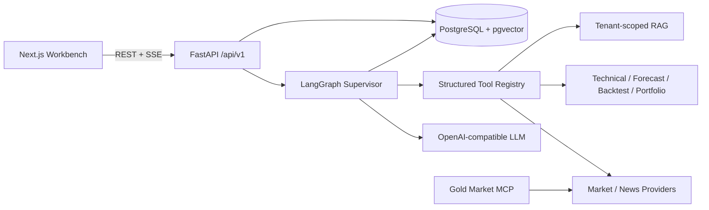

<div align="center">

# GoldAgent

### A full-stack, observable and evaluable AI Agent for gold-market research

GoldAgent lets an LLM dynamically select typed tools for live prices, technical indicators, timely news, forecasting, portfolio analysis, backtesting and private knowledge retrieval—then verifies sources and applies financial guardrails before answering.

[中文文档](README.md) · [Quick Start](#quick-start) · [Architecture](#architecture) · [Engineering Highlights](#engineering-highlights)


</div>

> GoldAgent is a research assistant. It does not connect to brokers, place trades, guarantee returns, or fabricate fallback market/news data.

## Why GoldAgent

The hard part of a financial Agent is not generating market commentary. It is building reliable boundaries between LLM decisions, deterministic calculations, real-time data, source provenance, tenant isolation and safe financial communication.

- **The model decides; tools establish facts.** The supervisor uses `tool_choice=auto`, while prices, indicators, PnL and backtests come from typed domain services.
- **Every important data point is traceable.** Market results carry source type, retrieval time and freshness metadata.
- **News freshness is enforced in code.** Results from the last 72 hours are prioritized; a 14-day window fills any shortage.
- **Safety is an explicit graph stage.** Tool results are verified and guaranteed-return language is removed before a response is returned.
- **It is more than a chat UI.** The repository includes auth, multi-user persistence, SSE execution events, RAG, evals, CI and Docker delivery.

## At a Glance

| Area | Implementation |
|---|---|
| Agent | LangGraph loop, autonomous typed-tool selection, retries, timeouts, verification, guardrails, checkpoints |
| Tools | **8** tools for price, history, indicators, news, forecast, portfolio, backtest and knowledge |
| API | **49** FastAPI routes |
| Quality | **55** offline eval cases and **27** backend/frontend tests, plus Playwright E2E |
| Product | Dashboard, Analysis, Agent Chat, Forecast, Backtest, Portfolio, News, Knowledge and Reports |

## Architecture



## Engineering Highlights

- **Agent runtime:** LangGraph state graph with iterative tool execution, source verification and a financial guardrail stage.
- **Backend:** Python 3.12, FastAPI, Pydantic v2, async httpx and provider-neutral OpenAI-compatible LLM adapters.
- **Quant:** pandas, NumPy, pandas-ta, walk-forward forecast evaluation, and no-look-ahead backtests with transaction costs.
- **Persistence:** SQLAlchemy 2 Async, Alembic, PostgreSQL 16 and pgvector; SQLite is explicitly demo-only.
- **RAG:** document parsing, chunking, embedding and user-scoped retrieval.
- **Frontend:** Next.js 15, React 19, TypeScript, Tailwind, TanStack Query, Zustand, ECharts and SSE Agent Activity.
- **Security & operations:** JWT/refresh tokens, PBKDF2, CORS, rate limits, request IDs, structured logs, health/readiness probes and non-root containers.
- **Quality:** pytest, Vitest, React Testing Library, Playwright, deterministic Agent evals and GitHub Actions.

## Quick Start

### Docker Compose

```powershell
Copy-Item .env.example .env
# Add an OpenAI-compatible LLM key to .env
docker compose up --build -d
```

- Web: `http://localhost:3000`
- API: `http://localhost:8080`
- OpenAPI: `http://localhost:8080/docs`

### Local Development

Requirements: Python 3.12+ and Node.js 22+.

```powershell
python -m venv .venv
.\.venv\Scripts\Activate.ps1
pip install -e ".[dev]"
Copy-Item .env.example .env
python run_backend.py

Set-Location frontend
npm ci
npm run dev
```

Use `.env.example` as the public template and keep real credentials only in `.env`. Tavily is optional unless real-time news is used.

## Verification

```powershell
.\.venv\Scripts\python.exe -m pytest
Set-Location frontend
npm run typecheck
npm test
npm run test:e2e
```

See the [Chinese README](README.md) for the complete architecture, source layout, API surface, design decisions, configuration, MCP and evaluation workflow.

## License

[MIT](LICENSE)
