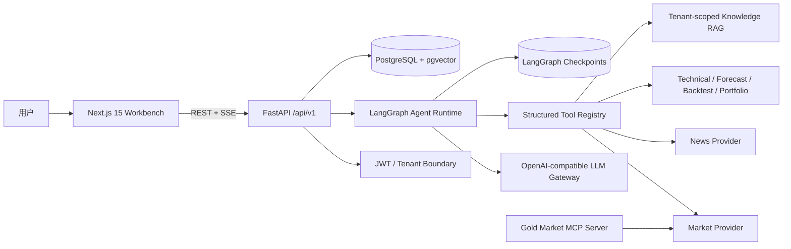
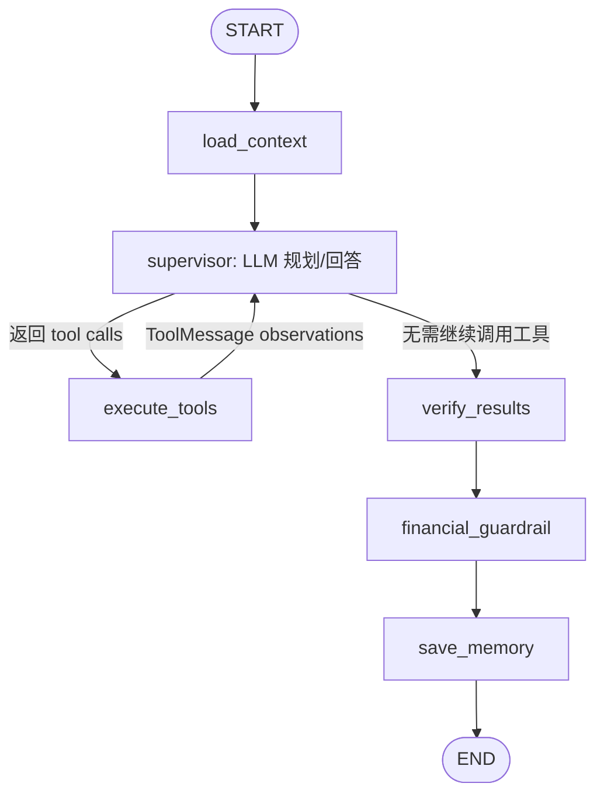
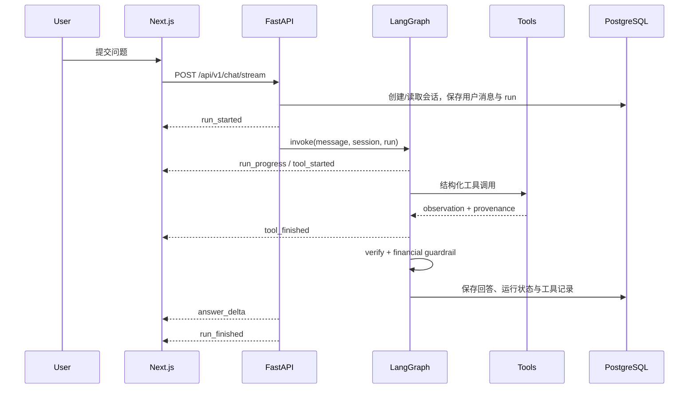

# GoldAgent Architecture

本文只描述 GoldAgent 当前可运行架构。历史审计、迁移计划和旧版兼容记录不属于运行时设计，已从开源文档入口移除。

## 1. 设计目标

GoldAgent 将语言模型的判断能力与可验证的金融计算分开：LLM 负责理解问题、选择工具和组织答案；价格、指标、预测、回测、持仓盈亏及知识检索由强类型工具和确定性服务完成。

核心原则：

- **模型负责决策，工具负责事实**：LLM 不直接编造行情或计算指标。
- **按问题动态选工具**：简单问答可以不调用工具；行情、新闻、预测等问题由模型依据工具描述与参数 Schema 决定调用哪些工具。
- **来源和新鲜度可追踪**：市场与新闻结果携带来源、抓取时间和 freshness metadata。
- **执行过程可观察**：前端展示阶段变化、工具名称、成功状态和耗时，不暴露隐藏推理。
- **金融回答有边界**：返回前核验工具结果，并应用金融风险护栏。

## 2. 系统全景

Docker Compose 将系统拆为三个服务：Next.js 前端、FastAPI 后端与 PostgreSQL/pgvector。开发模式允许 SQLite 和内存 Checkpointer；非 Demo 模式要求 PostgreSQL 持久化 Checkpoint。

## 3. Agent Runtime

Agent 核心位于 `backend/app/agent/graph.py`，不是关键词路由或固定工作流，而是带循环工具调用的 LangGraph 状态图。

一次运行的关键状态包括会话消息、`run_id`、工具结果、当前步数、最大步数、核验结果与最终答案。运行时还提供：

- 整体运行超时和最大执行步数；
- 单工具超时与有限重试；
- 工具异常结构化记录；
- 按会话和运行隔离的 Checkpoint namespace；
- `load_context`、`tool_started`、`tool_finished`、`verify`、`guardrail` 等进度事件。

每次运行前，API 还会按当前 `user_id` 加载已保存的投资组合、风险画像和回答偏好。它们只作为用户上下文影响回答，不能覆盖实时数据工具、来源核验和金融安全规则；持仓分析工具在未显式传参时默认使用这份已保存持仓。

## 4. 工具如何按问题选择

FastAPI 为每次请求构建可用工具集合，并把工具描述与 Pydantic 参数 Schema 交给 LLM Gateway。模型根据用户问题决定零个、一个或多个工具，工具结果作为 `ToolMessage` 返回模型；如果信息仍不足，模型可以继续调用其他工具，直到生成答案或达到步数上限。

| Tool | 事实来源 / 职责 | 典型问题 |
|---|---|---|
| `get_gold_spot_price` | 最新黄金价格与来源、新鲜度 | “AU0 现在多少钱？” |
| `get_market_history` | 有界 OHLCV 历史数据 | “最近三个月走势如何？” |
| `calculate_technical_indicators` | MA、RSI、MACD、ATR、支撑阻力 | “当前技术面偏多还是偏空？” |
| `search_financial_news` | Tavily 实时金融新闻 | “最近哪些消息影响黄金？” |
| `forecast_gold_price` | 明确标记为模型估计的基线预测 | “预测未来五天价格” |
| `analyze_portfolio` | 持仓 PnL、盈亏平衡与风险信息 | “我的积存金持仓盈亏多少？” |
| `run_backtest` | 含交易成本、避免未来函数的策略回测 | “均线策略历史表现如何？” |
| `retrieve_financial_knowledge` | 用户隔离的知识库检索，按需注册 | “根据我上传的研报回答” |

因此，右侧 Agent Activity 不应该每次显示相同工具：工具事实取决于模型针对当前问题产生的 tool calls。没有工具调用时，表示模型认为可以直接回答；需要实时事实却未调用工具，则可通过 Agent eval 数据集继续优化工具描述、Prompt 或模型能力。

## 5. Chat 请求与 SSE 事件链路

SSE 连接每 10 秒发送等待进度，避免长时间任务在 UI 中表现为无响应。浏览器断开时后端取消对应任务并记录运行状态。工具记录可通过 `GET /api/v1/agent/runs/{run_id}/tools` 查询。

## 6. 分层与代码边界

| Layer | Location | Responsibility |
|---|---|---|
| UI | `frontend/app`, `frontend/features` | 页面、双语界面、SSE Chat、Agent Activity |
| API | `backend/app/api` | 鉴权、Schema、路由、SSE、错误与中间件 |
| Agent | `backend/app/agent` | 状态图、工具循环、结果核验、金融护栏 |
| Tool | `backend/app/tools` | LLM 可见的强类型能力与超时边界 |
| Service | `backend/app/services` | 可测试的确定性金融业务逻辑 |
| Provider | `backend/app/providers` | AkShare、Tavily、Embedding 等外部适配器 |
| LLM | `backend/app/llm` | Provider-neutral chat/tool-calling gateway |
| Persistence | `backend/app/db`, `backend/app/memory` | Repository、会话、运行、工具记录、Checkpoint |
| Evaluation | `evals`, `tests` | 工具选择、参数、来源、风险表达和回归测试 |

依赖方向保持为 API/Agent → Tool → Service → Provider。Service 不依赖 FastAPI 或 LangGraph，因此金融计算可以脱离 Web 与 LLM 单独测试。

## 7. 数据可信度与新闻时效

市场数据由 Provider 返回，再经 Service 转换为统一 Schema。直接数据与推导数据必须在 metadata 中区分；外部服务失败时显式报错，不用伪造数据维持“成功”响应。

新闻检索采用两级时间窗：

1. 优先保留最近 72 小时结果；
2. 数量不足时，扩大到最近 14 天补齐；
3. 返回来源与发布时间，供 Agent 和用户判断时效；
4. 不用自然语言中的“最新”替代代码级时间过滤。

## 8. 持久化与租户隔离

- SQLAlchemy Async Repository 保存用户、会话、消息、Agent Run、工具调用和业务实体。
- PostgreSQL 是 Compose 与生产运行数据库，Alembic 管理 Schema 迁移。
- 知识库查询带 `user_id` 边界，避免跨用户检索文档。
- LangGraph 在生产模式使用 PostgreSQL Checkpointer；Demo 模式可用 `MemorySaver`。
- `.env`、本地数据库、运行日志、生成报告和内部规划文档不进入版本库。

## 9. 安全与运行边界

GoldAgent 是研究辅助系统，不连接券商、不执行交易、不保证收益。API 层提供 JWT/refresh token、密码哈希、CORS、请求 ID、结构化日志与健康检查；Agent 层在回答返回前应用金融风险护栏。

生产部署至少应：

- 使用 Node.js 22+、Python 3.12+ 和 PostgreSQL；
- 设置强随机 `JWT_SECRET_KEY` 与数据库密码；
- 只在 `.env` 或 Secret Manager 中保存 API Key；
- 配置受信任的 `FRONTEND_ORIGINS`；
- 关闭 `DEMO_MODE`，启用持久化 Checkpoint；
- 对任何曾暴露的 Key 在服务商控制台执行轮换。

## 10. 推荐阅读顺序

1. `backend/app/agent/graph.py`：Agent 状态图与迭代工具执行；
2. `backend/app/tools/registry.py`：模型可调用的工具集合；
3. `backend/app/services/`：确定性金融逻辑；
4. `backend/app/api/routes/agent.py`：Chat、SSE 与运行记录；
5. `frontend/features/chat/agent-chat.tsx`：前端流式交互和 Activity 展示；
6. `evals/README.md`：Agent 评测口径与回归方法。
