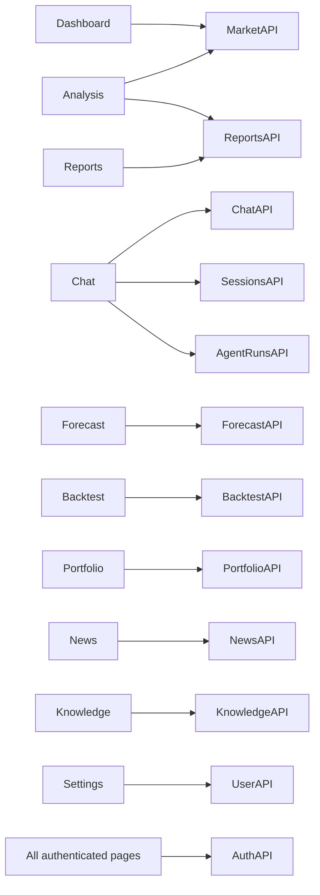

# GoldAgent Frontend Gap Analysis

> 本文是 Next.js 工作台建设前的历史差距快照。当前前端已经位于 `frontend/`，
> 原 `web/index.html` 已在 Phase 14 删除。

## Current Frontend Baseline

当前 `web/index.html` 是一个原生 HTML/CSS/JavaScript 的 Chat 页面。它已经覆盖会话、画像和 SSE 文本对话，适合作为兼容入口，但不具备金融 Dashboard 的页面体系、组件边界和测试能力。

## Page Gap Matrix

| 页面 | 当前是否存在 | 当前功能 | 缺失功能 | 所需后端 API | 优先级 |
|---|---|---|---|---|---|
| Dashboard | 否 | 无 | Summary、K 线、指标、AI View、freshness/source | market summary/history/indicators/support-resistance | P1 |
| Chat | 部分 | session、history、profile、SSE 文本 | rename/delete/search、Markdown、tool activity、sources、run status | chat、sessions、agent runs/tools | P1 |
| Analysis | 否 | CLI 有分析能力 | 市场/周期/指标选择、图表、AI 解释、data quality | market history/indicators/support-resistance、reports | P1 |
| Forecast | 否 | CLI/Chat 有预测 | 模型/horizon/lookback、区间、evaluation、历史回测 | forecasts CRUD/evaluation | P2 |
| Backtest | 否 | 后端也是 TODO | 参数表单、job status、KPI、曲线、交易表 | backtests CRUD/trades | P2 |
| Portfolio | 部分 | profile 和 Prompt 建议 | 结构化持仓、PnL、盈亏平衡、风险分析 | portfolio、portfolio analysis | P2 |
| News | 否 | 后端聊天链路调用 Tavily | 列表、过滤、发布时间、情绪、来源链接 | news、news refresh | P2 |
| Reports | 否 | 文件系统已有报告 | 列表、查看、下载、删除、重生成 | reports CRUD/download | P2 |
| Knowledge | 否 | 演示内存 RAG | 上传、ingestion status、chunk/embedding、搜索测试 | knowledge documents/search | P3 |
| Settings | 部分 | 风险画像 | provider/model、数据源、theme、streaming、Agent/RAG 参数 | users/me、safe settings API | P2 |
| Auth | 否 | 匿名 | login、refresh、logout、route protection、demo mode | auth endpoints | P3 |

## Frontend Information Architecture

```text
Public
└── /login                         # production；DEMO_MODE 可跳过

Application Shell
├── /dashboard                     # 默认首页
├── /analysis                      # 市场与技术分析
├── /chat                          # Agent 核心交互
│   └── /chat/[sessionId]
├── /forecast                      # 预测配置与结果
│   └── /forecast/[forecastId]
├── /backtest                      # 回测任务列表/创建
│   └── /backtest/[backtestId]
├── /portfolio                     # 持仓与风险
├── /news                          # 实时新闻
├── /reports                       # 报告资产
│   └── /reports/[reportId]
├── /knowledge                     # RAG 文档
└── /settings                      # 用户与应用设置
```

Desktop 使用 Topbar + Sidebar + Main Content。Mobile 使用 Topbar + Drawer/Bottom Navigation。页面共享全局 stale/error banner，但 server state 由各 feature 的 TanStack Query 管理。

## Frontend Route Map

| Route | Server Data | Mutations | Streaming/Job |
|---|---|---|---|
| `/dashboard` | market summary/history/indicators | market refresh | refresh status |
| `/analysis` | history/indicators/support-resistance | create report | optional analysis stream |
| `/chat/[id]` | session/messages/run tools | send message、rename/delete | SSE Agent protocol |
| `/forecast/[id]` | forecast/evaluation | create forecast | status polling/SSE |
| `/backtest/[id]` | backtest/trades | create/delete | async job status |
| `/portfolio` | portfolio/analysis | update portfolio/profile | optional analysis run |
| `/news` | news | refresh | refresh job status |
| `/reports/[id]` | report metadata/content | create/delete/regenerate | generation status |
| `/knowledge` | documents | upload/delete/search | ingestion status |
| `/settings` | safe settings/user/risk | update profile/preferences | none |

## Component Map

```text
components/
├── layout/
│   ├── AppShell
│   ├── Sidebar
│   ├── Topbar
│   └── MobileNavigation
├── common/
│   ├── AsyncState
│   ├── EmptyState
│   ├── ErrorState
│   ├── StaleDataBanner
│   └── SourceBadge
├── market/
│   ├── MarketSummaryBar
│   ├── MarketPriceCard
│   ├── TechnicalIndicatorCard
│   ├── SupportResistanceCard
│   └── DataQualityPanel
├── charts/
│   ├── GoldCandlestickChart
│   ├── IndicatorChart
│   ├── ForecastChart
│   ├── EquityCurve
│   └── DrawdownChart
├── agent/
│   ├── SessionList
│   ├── ChatMessage
│   ├── ChatInput
│   ├── AgentActivity
│   ├── ToolExecutionItem
│   └── SourceCitation
├── forecast/
├── backtest/
├── portfolio/
├── news/
├── report/
└── knowledge/
```

Feature 目录负责 query hooks、view models 和业务组合；`components/ui` 只包含无业务语义的基础组件。

## API Dependency Map



统一 client：

```text
services/api/
├── client.ts
├── schemas.ts or generated OpenAPI types
├── auth.ts
├── market.ts
├── chat.ts
├── sessions.ts
├── agent-runs.ts
├── forecasts.ts
├── backtests.ts
├── portfolio.ts
├── news.ts
├── reports.ts
├── knowledge.ts
└── users.ts
```

组件中不得散落 URL。TanStack Query 管理 server state；Zustand 仅保存 theme、drawer、当前 session 和临时筛选。

## Current API Mapping

| 旧前端动作 | 当前 API | 目标 API |
|---|---|---|
| 新建会话 | `POST /api/session/new` | `POST /api/v1/sessions` |
| 会话列表 | `GET /api/session/list` | `GET /api/v1/sessions` |
| 加载历史 | `GET /api/session/{id}/history` | `GET /api/v1/sessions/{id}/messages` |
| 加载画像 | `GET /api/profile/{id}` | `GET /api/v1/users/me` |
| 更新画像 | `POST /api/profile/{id}` | `PUT /api/v1/users/me/profile` |
| 流式聊天 | `POST /api/chat/stream` | `POST /api/v1/chat/stream` |

旧 API 必须保留到新前端完成迁移和 contract/E2E 测试后，再标记 deprecated。

## Backend Missing Endpoints

### P1 — Dashboard and Agent foundation

- `GET /api/v1/market/summary`
- `GET /api/v1/market/history`
- `POST /api/v1/market/refresh`
- `GET /api/v1/market/indicators`
- `GET /api/v1/market/support-resistance`
- `POST /api/v1/chat/stream`
- Session list/create/detail/rename/delete/messages
- `GET /api/v1/agent/runs/{run_id}`
- `GET /api/v1/agent/runs/{run_id}/tools`

### P2 — Domain product pages

- Forecast create/get/evaluation
- Backtest create/list/get/trades/delete
- Portfolio get/update/analysis
- News list/refresh
- Reports list/create/get/download/delete
- User profile/risk profile

### P3 — Knowledge and production

- Knowledge document CRUD/search
- Auth login/refresh/logout/me
- `/health` and `/ready`

所有 API 使用统一 success/error envelope；SSE 使用 `run_started/status/tool_started/tool_finished/answer_delta/run_finished/error`，不得暴露隐藏推理。

## Design System Proposal

### Tokens

| Token | Dark | Light | Usage |
|---|---|---|---|
| Background | warm charcoal | warm off-white | 页面底色 |
| Surface | neutral dark gray | white | Card/Panel |
| Primary | muted gold | deep muted gold | active/price emphasis |
| Text | soft white | near black | 主文本 |
| Muted | neutral gray | slate gray | 辅助信息 |
| Positive | low-saturation green | same | 上涨/成功 |
| Negative | low-saturation red | same | 下跌/错误 |
| Warning | amber | amber | stale/risk |

- Font：Geist/Inter/system-ui；数字启用 tabular-nums。
- 间距：4px 基础网格；Card 半径和阴影低调一致。
- 黄金色只用于品牌、关键价格、active 和重点 metric。
- 图表颜色必须同时通过形状、线型或标签表达，不能只依赖红绿。
- 每个异步容器显式支持 loading、empty、success、partial、error、stale。
- Source Badge 展示 source、direct/derived、retrieved_at、data period、URL/reference。

## Migration Plan

1. **Contract first**：后端先提供 `/api/v1/market/*`、统一 schema 和 recorded fixtures。
2. **Frontend foundation**：新建 `frontend/` Next.js，不覆盖 `web/index.html`；建立 shell、tokens、API client、query provider、error boundary。
3. **Dashboard vertical slice**：只接真实 market API，完成 freshness/source/chart 和所有异步状态。
4. **Agent Chat vertical slice**：接标准 SSE、session 和 run/tool endpoints；legacy Chat 继续可用。
5. **Analysis/Forecast**：复用 market chart，接结构化指标和 forecast evaluation。
6. **Portfolio/Backtest**：后端能力和测试完成后再开放页面，禁止静态假按钮。
7. **News/Reports/Knowledge/Settings**：按 API readiness 逐页接入。
8. **E2E cutover**：Playwright 覆盖关键路径后，将 `/` 导向新前端，旧页面保留一个发布周期。

每个 vertical slice 都必须有 TypeScript typecheck、Vitest/RTL、API contract test 和至少一个 Playwright happy path。
