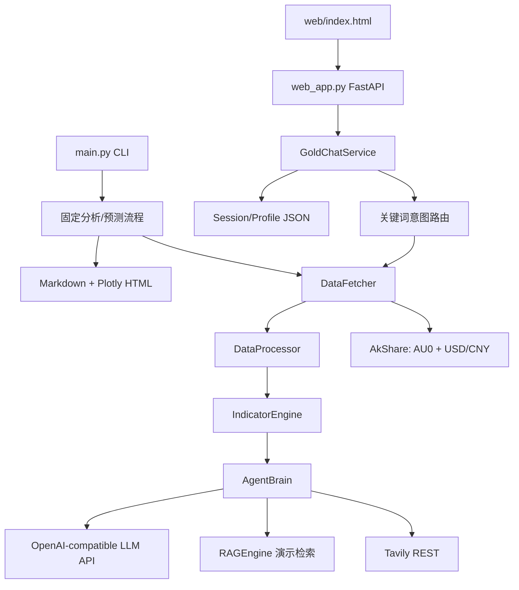
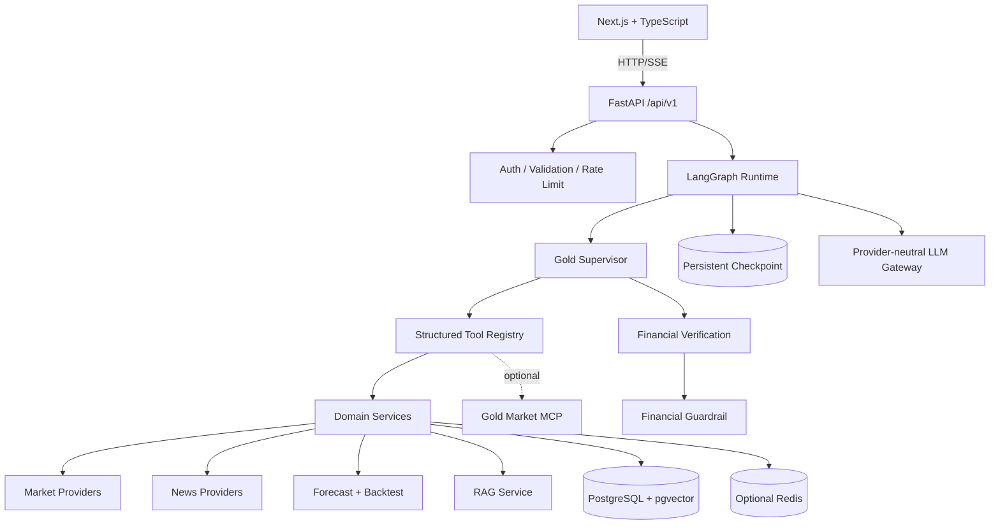

# GoldAgent Repository Audit

> 本文记录旧版 → 当前架构重构开始时的历史审计结论，不描述当前运行时。Phase 14
> 已完成旧 Web、规则路由和 JSON writer 删除；当前状态见
> `docs/legacy_compatibility.md`。

审计日期：2026-08-20  
审计范围：当前工作区源码、配置、依赖、旧前端、样例数据、报告、日志和运行入口。  
执行约束：未调用 AkShare、Tavily、LLM 或其他付费/外部 API；未修改核心业务代码。

## Executive Summary

GoldAgent 当前是一个可运行的黄金/工行积存金分析原型。它已经串联行情处理、技术指标、新闻搜索、LLM 增强、预测、报告和多轮聊天，但运行模型仍是确定性业务流程与关键词路由，不是能够自主选择工具并多步观察的 Agent Runtime。

当前最需要先解决的四件事是：

1. 撤销并移除工作区中的明文密钥，收紧会话文件路径、CORS 和匿名数据访问。
2. 修复重复 YAML 顶层键以及模型、环境变量、README 之间的配置漂移。
3. 建立可独立测试的 Provider、Service 和强类型 Schema，先校正行情来源语义，再包装成 Tool。
4. 建立最小测试基线后，渐进引入 LangGraph、PostgreSQL、Next.js，而不是一次性替换旧系统。

## Current Architecture



实际调用关系为：

- CLI 分析：取数 → 合并/周线重采样 → 指标 → Tavily → 规则分析 + LLM 融合 → Markdown/Plotly。
- CLI 预测：同一数据准备流程 → 三种基线模型对比 → 当前配置模型预测 → Tavily → LLM 融合 → 报告/图表。
- Web 对话：关键词识别 intent → 会话级行情缓存 → 分析、预测、个性化建议或通用问答 → JSON 持久化。
- Web 的 general/advice 会转发 LLM token；analysis/forecast 虽使用 SSE，但通常一次性发送完整格式化文本。

## Runtime Entry Points

| 入口 | 启动方式 | 职责 | 当前状态 |
|---|---|---|---|
| `main.py` | `python main.py --task ...` | analyze/forecast/report/chat/backtest | 前四项可调用；backtest 是占位 |
| `run_web.py` | `python run_web.py` | 启动 Uvicorn | 可导入 |
| `web_app.py` | `uvicorn web_app:app` | FastAPI + 静态旧前端 | 可导入 |
| `notebook.ipynb` | Jupyter | 早期探索流程 | 已漂移，不应作为回归入口 |

CLI 兼容面在 Phase 1–9 期间必须保留：`analyze`、`forecast`、`report`、`chat`；`backtest` 逐步由占位升级为真实实现。

## Module Responsibilities

| 模块 | 当前职责 | 评价 | 迁移方向 |
|---|---|---|---|
| `src/config_loader.py` | YAML + `.env` 加载、点路径读取 | 无类型验证、重复键静默覆盖 | Pydantic Settings + YAML 唯一键检测 |
| `src/data_fetcher.py` | AU0、汇率、推导国际金价 | Provider、业务转换和 fallback 混在一起 | Market Provider + Market Service |
| `src/data_processor.py` | 时区、缺失值、溢价、标准化 | 多数函数可复用 | Domain Service，补不变量测试 |
| `src/indicator_engine.py` | 指标、信号、预测、置信度 | 指标与预测职责混合 | TechnicalService + Forecast models |
| `src/tavily_search.py` | Tavily REST 和降级 | 同步 I/O、无统一错误模型 | Async News Provider |
| `src/rag_engine.py` | 演示新闻、Embedding、相似度 | 不是持久化知识库 | 独立 Knowledge/RAG Service |
| `src/agent_brain.py` | Prompt、LLM、规则、新闻融合、预测融合、报告 | 1,700+ 行 God Object | LLM Gateway + Agent graph + workflows |
| `src/chat_service.py` | 会话、画像、缓存、意图路由、回答 | 1,100+ 行且耦合所有服务 | Session Service + Agent Runtime façade |
| `src/visualizer.py` | Plotly 报告图表 | 可保留用于导出 | Report/Export Service |
| `main.py` | CLI、业务编排、报告模板、图表 | 1,500+ 行，业务重复 | Thin CLI adapter + workflows |
| `web_app.py` | Router、Schema、CORS、静态文件 | 单文件 API，可控但不分层 | `/api/v1` routers + middleware |
| `web/index.html` | Chat、画像、会话列表 | 单文件原生前端 | 保留 legacy，旁路建设 Next.js |

## Tool-like Capability Inventory

这些模块具有 Tool 候选能力，但现在都不是强类型 Structured Tool：

| 候选 Tool | 现有实现 | 需要的 Service/Provider |
|---|---|---|
| `get_gold_market_history` | `DataFetcher.fetch_domestic_gold` | `MarketService` / `AkShareProvider` |
| `get_exchange_rate` | `fetch_international_gold` 内部逻辑 | 独立 `FxProvider` |
| `get_derived_gold_price` | `fetch_international_gold` | `DerivedMarketProvider` |
| `calculate_technical_indicators` | `IndicatorEngine.calculate_all_indicators` | `TechnicalAnalysisService` |
| `detect_trend` | `AgentBrain._determine_trend` | `TechnicalAnalysisService` |
| `search_financial_news` | `TavilySearcher.search_for_gold_news` | `NewsService` / `TavilyProvider` |
| `forecast_gold_price` | `IndicatorEngine.forecast_trend` | `ForecastService` + model registry |
| `analyze_portfolio` | Chat prompt 中的个性化建议 | `PortfolioService`，不可只放 Prompt |
| `run_backtest` | `main.run_backtest` | 尚未实现 |
| `retrieve_financial_knowledge` | `RAGEngine.retrieve_relevant_news` | pgvector Retriever |
| `generate_market_report` | `main.py` + `AgentBrain.generate_report` | `ReportService` |

每个未来 Tool Result 必须携带 `source`、`is_derived`、`retrieved_at`、`data_start`、`data_end`、`currency`、`market`、`symbol`，并只向 LLM 暴露摘要、指标、元数据和引用，不传完整 DataFrame。

## Dependency Audit

### 直接使用

- Runtime：`pandas`、`numpy`、`akshare`、`pandas-ta`、`requests`、`plotly`、`scikit-learn`、`pyyaml`、`python-dotenv`、`pytz`。
- API：`fastapi`、`pydantic`、`uvicorn`。

### requirements 声明但主源码未使用

- `yfinance`
- `langchain`
- `dashscope`
- `ta-lib`
- `sqlalchemy`
- `beautifulsoup4`
- `chromadb`

其中部分是目标架构未来会使用的能力，但不能继续作为“已经使用”的技术栈描述。

### 源码使用但 requirements 未显式声明

- `pydantic`（当前由 FastAPI 间接安装）
- `pytz`

### 当前环境与目标依赖

- 已安装：FastAPI 0.135.2、Pydantic 2.12.5、pydantic-settings 2.13.1、LangGraph 1.1.3、langchain-core 1.2.21、SQLAlchemy 2.0.48、httpx 0.28.1、tenacity 9.1.4。
- 未安装：Alembic、PostgreSQL driver、pgvector、Redis client、pytest。
- `pip check`：通过，无已安装包的依赖冲突。

Phase 1 应以 `pyproject.toml` 区分 runtime/dev/legacy optional dependencies，不能简单把当前虚拟环境反写成项目依赖。

## Configuration Audit

1. `config.yaml` 有两个顶层 `indicators`。PyYAML 默认保留后一个，前一个被静默覆盖。
2. 有效 MA 配置实际为 `[5, 20, 60]`，不是前段声明的 `[5, 20, 60, 120, 250]`。
3. `indicators.signal_threshold`、RSI overbought/oversold 等前段配置实际不可见。
4. 当前磁盘配置已是 `mimo-v2.5-pro` + 小米 MiMo base URL，但代码仍从 `DASHSCOPE_API_KEY` 读取，并打印“通义千问已配置”。Provider、模型、Key 名称和日志语义仍未统一。
5. README、旧日志、Improvement Report、默认值分别出现 Qwen、DashScope、智谱和 MiMo 等不同代配置。
6. `processing.resample_freq` 声明可配置，但积存金主流程硬编码为周线 `W`；应明确这是策略不变量还是配置项。
7. `agent.max_tokens=65536` 缺少 provider 能力校验和安全上限。
8. 配置没有 fail-fast 类型验证、URL 校验、重复键检测或 secret 类型。

## Security Audit

### Critical

- `config.yaml` 存在明文 Tavily Key。该 Key 应视为已经泄露，必须由所有者撤销并重新生成。
- `.env` 包含 LLM/Tavily 凭据。虽然 `.gitignore` 已忽略 `.env`，但当前目录不是 Git 仓库，无法审计历史是否曾提交。
- `ChatMemoryStore._path()` 直接把请求提供的 `session_id` 拼接到文件路径。`POST /api/chat` 可传入任意 session ID，存在目录穿越/越界读取风险。Phase 1 必须限制为 UUID/受控 ID，并验证 `resolve()` 后仍位于会话目录内。

### High

- 无鉴权和用户隔离，任意调用者可列出全部会话、访问已知 session、读写任意 profile。
- CORS 使用 `allow_origins=["*"]` 且 `allow_credentials=True`，不适合作为生产配置。
- 无 rate limit；聊天、刷新行情和 LLM 调用可被滥用。
- 会话 JSON 与画像 JSON 不是原子写入，也没有并发锁，多 worker 时可能丢失或破坏数据。

### Medium

- 错误日志可能记录外部服务完整响应体；需防止 provider 返回内容携带敏感信息。
- 用户画像和完整聊天文本以明文 JSON 存储，没有保留期、删除、脱敏或访问审计。
- API 错误格式不统一，SSE 异常缺少结构化 `error` 事件。

### Existing protection

- `.gitignore` 已覆盖 `.env`、日志、生成报告和行情 CSV。
- 前端消息使用 `textContent`，当前没有直接把模型 HTML 注入 DOM。

## Data Source Audit

### 实际来源

- 国内行情：AkShare `futures_zh_daily_sina(symbol="AU0")`。
- 汇率：AkShare `currency_boc_sina(symbol="美元")`。
- “国际行情”：国内 AU0 价格按 USD/CNY 和盎司克重反推，是 derived source，不是 yfinance/COMEX 的独立数据。
- 汇率 fallback：内置年度平均汇率字典。
- 新闻：Tavily finance search。

### 数据语义风险

1. 用国内价格推导国际价格后再计算国内溢价，两个序列非独立，溢价不应标记为真实跨市场 premium。
2. 汇率在线源看起来按“每百外币”处理并除以 100；年度 fallback 已是约 6–7 的 USD/CNY，却仍统一除以 100，fallback 分支可能产生 100 倍量级错误。
3. `premium_fx_rate` 使用固定 7.20，而推导国际价使用另一条汇率序列，语义不一致。
4. 国内缺失 OHLCV 通过 `reindex(...).fillna(0)` 填零，可能制造异常 K 线与指标污染。
5. `merge_asof(direction="nearest")` 没有 tolerance，可能把距离过远的交易日错误对齐。
6. 每次 CLI 运行都会新增 CSV，没有保留策略、数据版本或 source metadata。

新 Provider 层必须显式返回 direct/derived/cache/simulation 类型。外部源失败时不得把模拟或推导数据伪装为实时直接行情。

## Agent Audit

当前 Agent 特征：

- `GoldChatService._classify_intent()` 通过关键词返回 help/exit/refresh/forecast/analyze/advice/general。
- `handle_message()` 与 `handle_message_stream()` 使用 `if/elif` 固定选择业务函数。
- `AgentBrain` 直接负责 LLM HTTP、流式解析、Prompt、规则分析、新闻融合和预测融合。
- 没有 LangGraph State、ToolNode、checkpoint、max steps、verification node、guardrail node、interrupt/resume。
- LLM 不拥有工具选择权，也不能基于 observation 再选择第二个工具。
- `analysis_history` 只存在于进程内，未作为可靠 memory 使用。

因此当前是 workflow assistant，不满足目标 Agent acceptance criteria。可迁移部分是业务服务和格式化逻辑，不应直接把 `agent_brain.py` 包装成一个巨型 Tool。

## RAG Audit

- `RAGEngine.refresh_news()` 主要加载内置演示新闻。
- 可调用 DashScope embedding endpoint，也可退化为本地简单向量。
- 检索在内存列表上做余弦或关键词匹配。
- 无文档上传、解析、chunk、持久化、metadata filter、租户隔离、pgvector 或 ingestion 状态。
- 实时 Tavily 新闻与 RAG 在命名、Prompt 和 README 中有所混用。

目标必须拆开：Tavily = real-time search；PostgreSQL/pgvector = long-term curated knowledge。

## Forecast Audit

- 模型：全历史线性回归、MA 趋势外推、指数平滑趋势外推。
- 当前配置：3 个周期、exponential。
- CLI 报告会运行三种模型供对比。
- 没有 train/test 时间切分、rolling-origin evaluation、模型版本或预测持久化。
- `confidence_upper/lower` 只是预测值 ± 残差标准差，不是经过校准的置信区间。
- heuristic confidence 在 RSI 接近 50 时给更高的 `trend_strength`，命名与“趋势越强置信度越高”的注释不一致。
- 报告中容易把启发式 confidence 显示成百分比概率。

现有模型应保留为 baseline，但必须引入统一 `ForecastModel`、离线评估和清晰的 `heuristic_score` 命名。

## Backtest Audit

`main.run_backtest()` 仅记录 TODO，没有持仓、交易、成本、benchmark 或指标实现。当前不存在回测 API、数据模型、异步任务或前端页面。`generate_signals()` 直接对每一行给出持仓方向，未来回测必须将信号至少 shift 一个执行周期，防止 look-ahead bias。

## Session and Memory Audit

- 短期上下文：最近 `context_turns * 2` 条消息拼接进 Prompt。
- 行情缓存：按 session 存放在进程内 `runtime_cache`，默认 60 分钟。
- 会话持久化：`data/chat_sessions/{session_id}.json`。
- 长期画像：`data/chat_profiles.json`，保存风险偏好、最大回撤、周期和备注。
- 没有 checkpoint、事务、版本、并发控制、用户所有权或 resume graph state。
- 用户消息中的“保守/稳健/激进、最大回撤、周期”会自动写入长期画像，尚无明确确认流程。

## Report Audit

- 分析和预测生成 Markdown，Plotly 生成约数 MB 的独立 HTML。
- 报告不是数据库实体，没有 owner、source snapshot、版本、状态或 API CRUD。
- 报告模板散落在 `main.py` 和 `AgentBrain`，存在重复职责。
- Web 前端不能浏览、下载或删除报告。

Plotly 可保留作导出；新 Dashboard 应返回图表数据而不是以 HTML 报告作为主要交互层。

## Frontend Audit

当前只有一个 Chat 页面，包含：

- Profile ID、风险偏好、最大回撤、投资周期、备注编辑。
- 会话新建、列表、选择和恢复历史。
- SSE 对话、强制刷新、基本状态文本。
- localStorage 保存 session/profile ID。

缺失：Dashboard、分析、预测、回测、持仓、新闻、报告、知识库、设置页面；Markdown 渲染、图表、source citation、tool trace、freshness、标准 loading/error/empty/partial/stale 状态；响应式产品导航；前端测试。

## Backend API Audit

### 当前 API 与前端使用情况

| 方法 | 路径 | 后端能力 | 旧前端使用 |
|---|---|---|---|
| GET | `/api/health` | 静态 `ok` | 否 |
| POST | `/api/session/new` | 新建会话 | 是 |
| GET | `/api/session/list` | 列出所有会话 | 是 |
| GET | `/api/session/{id}/history` | 会话历史 | 是 |
| GET | `/api/profile/{id}` | 读取画像 | 是 |
| POST | `/api/profile/{id}` | 更新画像 | 是 |
| POST | `/api/chat` | 非流式聊天 | 否 |
| POST | `/api/chat/stream` | SSE 聊天 | 是 |
| GET | `/` | 返回 legacy HTML | 浏览器入口 |

### API 设计问题

- 无 `/api/v1`、统一 envelope、结构化 error code 或 request correlation ID。
- Router、Schema、CORS、服务实例和静态文件均在单文件。
- 所有 handler 是同步函数；行情、Tavily、LLM 都使用同步 `requests`。
- 无 session rename/delete/search；无 agent run/tool trace。
- 无 market、forecast、backtest、portfolio、news、reports、knowledge、user API。
- `/api/health` 不是规格要求的 `/health`，也没有 `/ready`。

## Frontend-to-Backend Mapping

```text
profile load/save  -> GET/POST /api/profile/{id}
session list       -> GET /api/session/list?limit=50
new session        -> POST /api/session/new?profile_id=...
history            -> GET /api/session/{id}/history
chat streaming     -> POST /api/chat/stream
```

后端已有但前端未使用：`GET /api/health`、`POST /api/chat`。前端需要但后端完全缺失的资源 API 详见 `frontend_gap_analysis.md`。

## Database Audit

- 当前没有数据库、ORM、migration 或 repository abstraction。
- SQLAlchemy 虽列在 requirements 且当前环境已安装，但源码未使用。
- 所有 session/profile 使用本地 JSON；行情、报告使用文件。
- 无 PostgreSQL、pgvector、LangGraph persistent checkpoint 或 Redis。

建议先定义 Repository Protocol 并提供 SQLite 开发适配器/测试替身，再接 PostgreSQL；生产模型和迁移以 PostgreSQL 为准。不要让数据库接入阻断 legacy CLI。

## Testing Audit

- 未发现 `tests/`、pytest 配置、前端 package/test、CI 或 Docker smoke test。
- `python -m pytest -q`：失败，当前虚拟环境未安装 pytest。
- Python 语法编译：`main.py`、Web 入口和全部 `src/*.py` 通过。
- 核心导入：`main`、`web_app`、`GoldChatService` 通过；初始化不会立即调用外部 API。
- `pip check`：通过。
- 未进行联网行情、新闻、Embedding 或 LLM 集成测试。

## Dead Code

- `main.py` 中早期 CLI chat helper 与 `GoldChatService` 存在重复职责。
- `AgentBrain` 中旧融合预测实现被后续同名方法覆盖，属于不可达实现。
- `RAGEngine` 的演示新闻路径不是当前 Tavily 主链路，却仍影响 RAG 命名和 Prompt。
- Notebook 使用旧配置路径 `data.processing`、旧键 `indicator` 和旧列 `close_2`，已不适合作为可执行文档。
- README 中 yfinance、DashScope SDK、LangChain 等描述与实际运行不符。

## Duplicate Code

- `AgentBrain.forecast_with_dual_fallback()` 在同一类中定义两次，后者覆盖前者。
- `main.py` 与 `chat_service.py` 重复 intent、forecast days、新闻 query、分析/预测回复格式和数据准备逻辑。
- 报告/预测的方向、支撑阻力和建议在规则代码、Prompt、Markdown 模板中多次表达。
- `AgentBrain.forecast_with_dual_fallback` 与 `_forecast_with_news_and_llm` 形成多层嵌套结果，结构较难稳定消费。

## Documentation Drift

- README 将国际行情描述为 yfinance，实际是 AkShare 国内价推导。
- README 主要描述 DashScope/Qwen，当前磁盘配置为 MiMo。
- Improvement Report 的行号、模型名和当前源码不一致。
- Notebook 配置路径和数据列已经过期。
- README 称“生产就绪”，与无鉴权、无测试、文件持久化现状不符。

## Migration Risks

| 风险 | 影响 | 控制措施 |
|---|---|---|
| 一次替换所有入口 | CLI/Web 同时不可用 | 新旧并行，adapter 保持兼容 |
| 未先校正行情语义 | 新 Agent 放大错误数据 | Provider metadata + data quality tests |
| LangGraph 直接包 God Object | 只有框架外观，无可测试工具 | 先 Service/Provider，再 Tool/Graph |
| 数据库迁移丢历史 | 会话和画像损失 | 幂等导入脚本、备份、校验计数 |
| Next.js 与未定 API 并行漂移 | 页面依赖假接口 | OpenAPI/schema-first + contract tests |
| LLM provider tool calling 差异 | Agent loop 不稳定 | Gateway capability flags + fake provider tests |
| 金融建议风险 | 不当确定性表达 | verification + guardrail + eval dataset |
| 外部源不稳定 | 测试慢且不确定 | 默认 mock/recorded fixtures，显式 integration profile |

## Reusable Components

- `DataProcessor` 的时区和数据清洗框架。
- `IndicatorEngine` 的指标计算，修正配置和输入校验后可迁移。
- 三个 Forecast baseline，可作为 model registry 初始实现。
- `Visualizer` 的 Plotly 报告导出。
- Tavily 请求/结果字段经验，可迁移进 async provider。
- 会话 JSON 可作为 PostgreSQL 迁移输入。
- 工行积存金周线主策略、日线辅助和成本阈值作为 domain policy。
- 现有 Markdown 报告和聊天样例可转成 evaluation seed，不直接当 ground truth。

## Refactor Priority

1. **P0 Critical**：secret、session path、配置唯一性、数据来源语义、测试基线。
2. **P1 Core Agent**：Provider/Service、LLM Gateway、Structured Tools、LangGraph、verification/guardrail、真实 backtest。
3. **P2 Productization**：`/api/v1`、PostgreSQL/pgvector、Next.js Dashboard/Chat/业务页面。
4. **P3 Production Hardening**：Auth、rate limit、observability、eval、MCP、Docker/CI、legacy removal。

## Target Architecture



设计原则：Single Supervisor + Structured Tools + Deterministic Subgraphs；不引入无价值 Multi-Agent；外部 API 失败返回结构化错误或明确 stale cache，禁止伪造实时数据。

## Backend Gap Analysis

| 能力 | 当前 | 目标差距 | 优先级 |
|---|---|---|---|
| Config | YAML + dotenv | typed settings、重复键和启动验证 | P0 |
| Security | 匿名、开放 CORS | secret rotation、ID validation、auth/rate limit | P0/P3 |
| Market | AkShare + derived | provider metadata、真实独立源、cache policy | P0/P1 |
| Agent | keyword router | LangGraph loop、state、tools、verify、guardrail | P1 |
| LLM | AgentBrain 直连 | provider-neutral async gateway | P1 |
| Backtest | TODO | engine、metrics、no look-ahead、API | P1/P2 |
| Forecast | baseline | model interface、evaluation、persistence | P1/P2 |
| Persistence | JSON/files | repository、PostgreSQL、Alembic | P1/P2 |
| RAG | demo in-memory | ingestion、pgvector、metadata/source | P2 |
| API | 8 legacy endpoints | versioned resources、envelope、SSE events | P2 |
| Observability | text log | run/tool/LLM structured traces | P3 |
| Evaluation | none | datasets, deterministic evaluators, reports | P3 |

## Verification Record

| 检查 | 结果 |
|---|---|
| 项目树扫描 | 完成 |
| Python 入口/API/前端调用链 | 完成 |
| Secret 形态扫描 | 完成，未在文档中复制任何值 |
| Python syntax compile | 通过 |
| Core import smoke | 通过 |
| Installed dependency check | 通过 |
| Existing pytest suite | 无法执行：没有 pytest 且无测试目录 |
| External/paid API | 未调用 |
| Git history audit | 无法执行：当前目录不是 Git repository |

注：审计期间 `config.yaml` 与 `.env` 的修改时间发生了外部变化；本报告中的有效模型结论已按最终磁盘状态 `mimo-v2.5-pro` 重新核对。审计过程未改动这两个文件。
